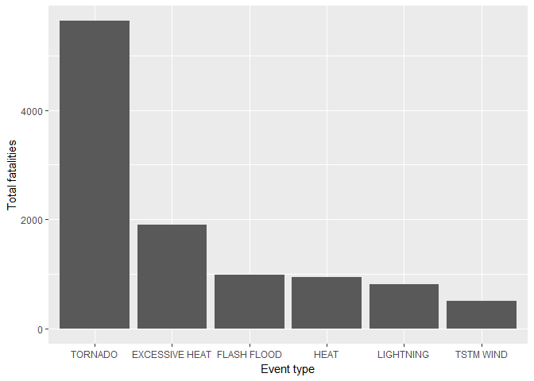
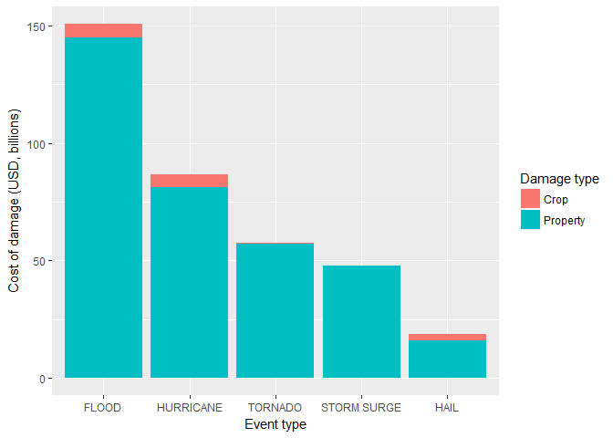

## Synopsis
***

This document considers the impact of severe weather events in the US between 1950 and November 2011, as recorded in the NOAA Storm Database. Specifically, it investigates which weather events resulted in the highest number of fatalities, injuries, property damage, and crop damage. It was found that TORNADO events resulted in the most fatalities and injuries, whereas FLOOD and DROUGHT events resulted in the most damage to property and crops respectively.


## Data processing
***

Load libraries:

```r
library(dplyr)
library(ggplot2)
library(tidyr)
library(knitr)
```


Load data from compressed `.csv` file:

```r
df <- read.csv(bzfile('StormData.csv.bz2'), stringsAsFactors=FALSE)
```

Some rows have multiple events listed under `EVTYPE`, separated by a `/` character. It is assumed that the first event is the most significant of the two, so here the rows are mutated to remove any additional events:

```r
df$EVTYPE <- sub("\\/.*", "", df$EVTYPE)
```

Multipliers for the `PROPDMG` and `CROPDMG` columns are stored as alphabetic characters in the `PROPDMGEXP` and `CROPDMGEXP` columns, these are applied here to create the `PROPDMGCOST` and `CROPDMGCOST` columns:

```r
get_multiplier <- function(multiplier_letter){
  if (multiplier_letter=='K') return(1e3)
  if (multiplier_letter=='M') return(1e6)
  if (multiplier_letter=='B') return(1e9)
  return(1)
}

df$PROPMULTIPLIER <- sapply(df$PROPDMGEXP, FUN=get_multiplier)
df$CROPMULTIPLIER <- sapply(df$CROPDMGEXP, FUN=get_multiplier)

df <- mutate(df, PROPDMGCOST=PROPDMG*PROPMULTIPLIER, CROPDMGCOST=CROPDMG*CROPMULTIPLIER)
```


Prepare summarised data frames containing totalled damages for each event:

```r
summary_df <- df %>%
              group_by(EVTYPE) %>%
              summarise(fatal=sum(FATALITIES),
                        injured=sum(INJURIES),
                        propdmg=sum(PROPDMGCOST),
                        cropdmg=sum(CROPDMGCOST))

# Put economic data in long-form for plotting later on:
summary_df_cost <- summary_df %>%
                   mutate(total_cost=propdmg+cropdmg) %>% 
                   select(-injured, -fatal) %>%
                   gather(damage_type, cost_of_damage, propdmg, cropdmg)
```


## Results
***

### Part 1: Population health

The events resulting in the most fatalities were **TORNADO** and **EXCESSIVE HEAT**:

```r
fatality_df <- summary_df %>% 
               arrange(-fatal) %>%
               head() %>%
               select(EVTYPE, fatal)

kable(fatality_df)
```


EVTYPE            fatal
---------------  ------
TORNADO            5633
EXCESSIVE HEAT     1903
FLASH FLOOD         992
HEAT                937
LIGHTNING           816
TSTM WIND           509

```r
g <- ggplot(fatality_df, aes(x=reorder(EVTYPE, -fatal), y=fatal))
g + geom_col() + labs(x='Event type', y='Total fatalities')
```

<!-- -->

The events resulting in the most injuries were **TORNADO** and **TSTM WIND**:

```r
summary_df %>% arrange(-injured) %>%
               head() %>%
               select(EVTYPE, injured) %>% 
               kable()
```


EVTYPE            injured
---------------  --------
TORNADO             91346
TSTM WIND            7052
FLOOD                6804
EXCESSIVE HEAT       6525
LIGHTNING            5230
HEAT                 2100

### Part 2: Economic cost

The events resulting in the most damage to property were **FLOOD** and **HURRICANE**:

```r
summary_df %>% arrange(-propdmg) %>%
               head() %>%
               select(EVTYPE, propdmg) %>% 
               kable()
```


EVTYPE              propdmg
------------  -------------
FLOOD          144833263816
HURRICANE       81174159010
TORNADO         56925660790
STORM SURGE     47964724000
FLASH FLOOD     16413765073
HAIL            15727867553

The events resulting in the most damage to crops were **DROUGHT** and **FLOOD**:

```r
summary_df %>% arrange(-cropdmg) %>%
               head() %>%
               select(EVTYPE, cropdmg) %>% 
               kable()
```


EVTYPE             cropdmg
------------  ------------
DROUGHT        13972571780
FLOOD           5869802450
HURRICANE       5349782800
RIVER FLOOD     5029459000
ICE STORM       5022113500
HAIL            3025588040

Plotting the combined costs, it would appear that the cost of property damage tends to far exceed that of crop damage:

```r
combined_cost_df <- summary_df_cost %>% 
                    arrange(-total_cost) %>% 
                    head(10) %>%
                    mutate(cost_of_damage=cost_of_damage/1e9)

g <- ggplot(combined_cost_df, aes(x=reorder(EVTYPE, -total_cost), y=cost_of_damage, fill=damage_type))
g + geom_col() + labs(x='Event type', y='Cost of damage (USD, billions)') +
    scale_fill_discrete("Damage type", labels=c("Crop", "Property"))
```

<!-- -->

